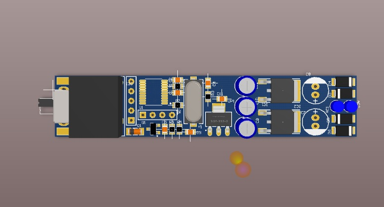
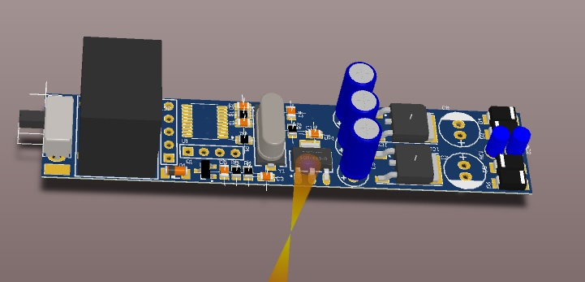
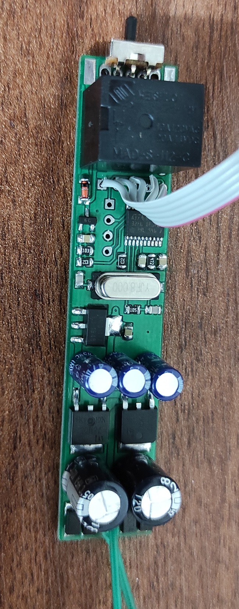
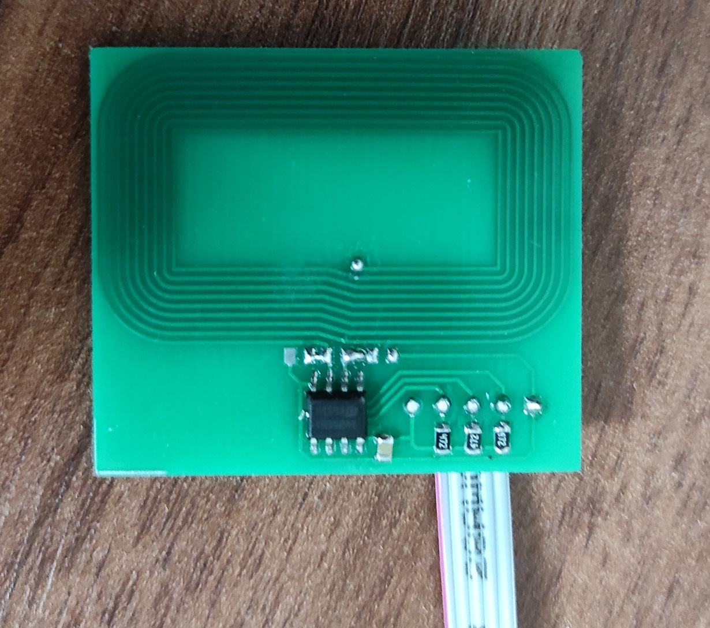
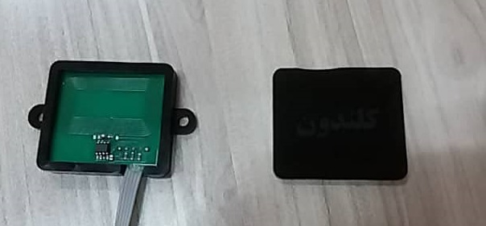

# NFC Keychain

This project is a compact NFC-enabled keychain device. It appears to be designed for secure communication or identification, potentially interfacing with other systems like an ESP8266 module via a serial protocol with CRC validation.

## Project Structure

The repository is structured as follows:

- **MCU Code/**: Firmware and related code.
    - **NFC_V2.0/**: The main STM32 firmware project (STM32CubeIDE).
        - Targeted at the **STM32F070F6** microcontroller (based on `.ld` file).
    - `CrcCalculation.txt`: C code snippet for calculating CRC checks, ensuring data integrity in communications.

- **PCB/**: Hardware designs.
    - **Antenna/**: Specific design for the NFC antenna trace.
    - **Main/**: The main circuit board layout.

- **Mechanical Design/**:
    - `Antenna Frame.cdr`: CorelDRAW file for the physical antenna frame or enclosure.

- **Media/**:
    - **Pictures/**: Images of the device (`1.jpg` to `5.jpg`).

## Features

- **NFC Connectivity**: Likely operates as a tag or reader/writer (specifics depend on the antenna and driver implementation).
- **Communication Protocol**: Implements a robust communication link (possibly UART) with CRC checksums (`CrcCalculation.txt`) to prevent data corruption.
- **Embedded Control**: Powered by an ultra-low-power STM32F0 series microcontroller.

## Usage

1. **Hardware**:
   - Fabricate the Main PCB and the Antenna PCB.
   - Assemble the STM32F070F6 and associated components.
2. **Firmware**:
   - Open `MCU Code/NFC_V2.0/NFC_V0.2.ioc` in STM32CubeIDE (or the relevant project file).
   - Build and flash the firmware to the MCU.
3. **Integration**:
   - If connecting to an external module (e.g., ESP8266), ensure the serial connections matching the defined protocol are correct.

## Gallery

